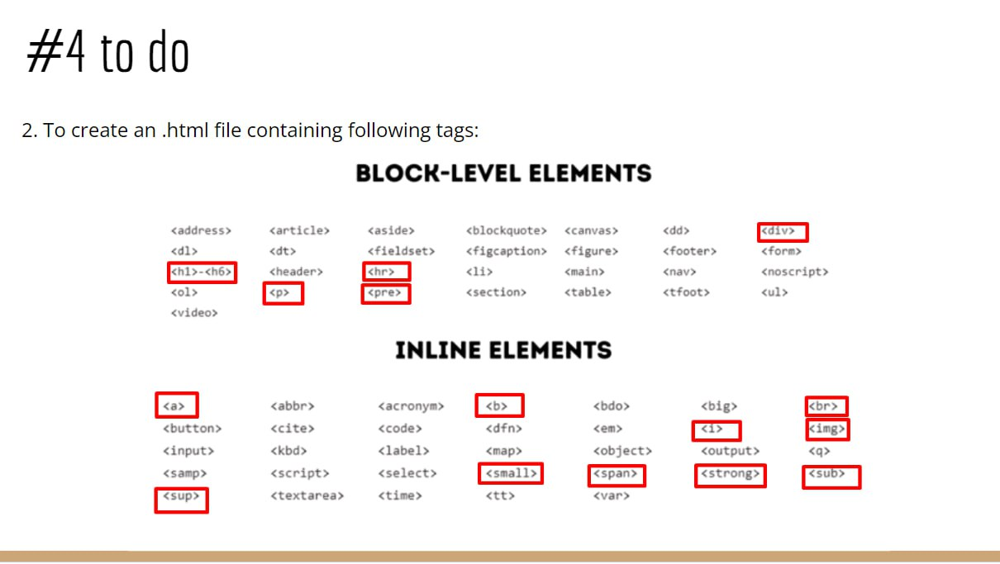
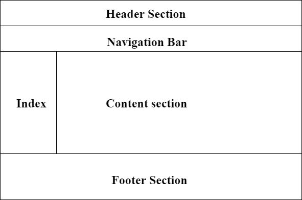
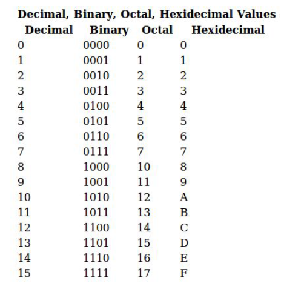
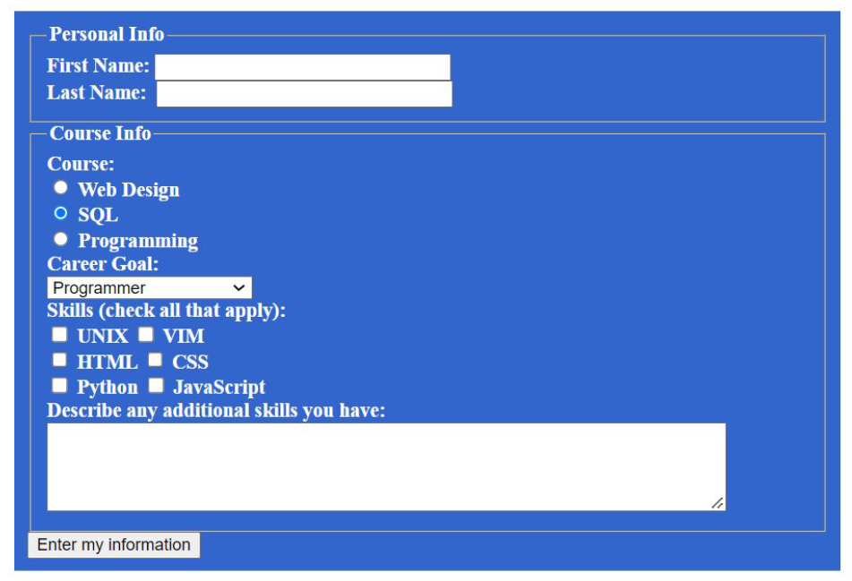
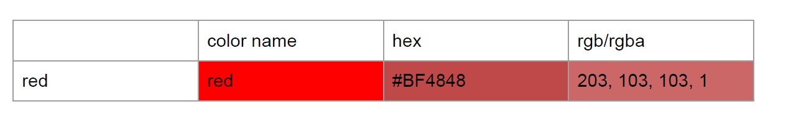
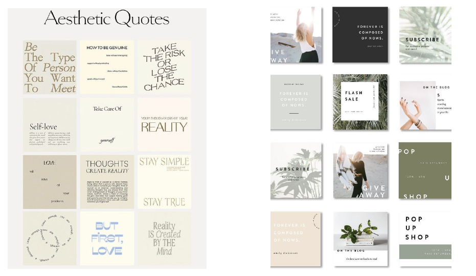
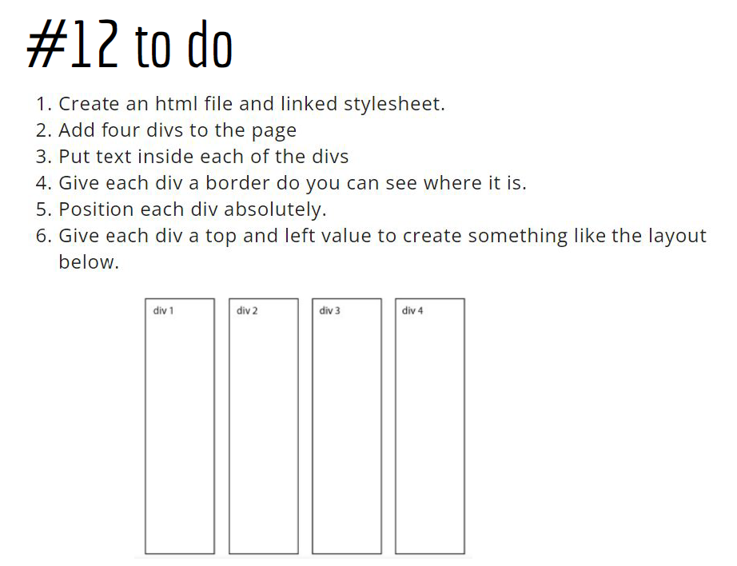
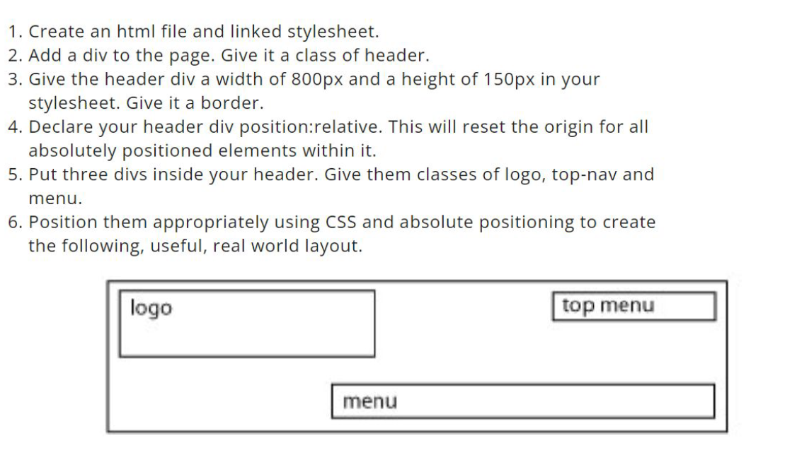

# FrontEnd-Tasks-Repository
Repository for FrontEnd tasks

# Tasks for FrontEnd Development Course
***

## Contents
1. [Task 1]
2. [Task 2]
3. [Task 3]
4. [Task 4]
5. [Task 5]
6. [Task 6]
7. [Task 7]
8. [Task 8]
9. [Task 9]
10. [Task 10]
11. [Task 11]
12. [Task 12]

## Task 1:
1. Download VSCode                      see: https://code.visualstudio.com/Download
2. Download Git                         see: https://git-scm.com/
3. Make an account on GitHub            see: https://github.com/

## Task 2:
1. Clone the existing remote repository https://github.com/ngoncearu/team-repository
2. git fetch the changes from remote repository
3. Create a branch with a name as `name-surname` (ex: natalia-goncearu)
4. Create a new file under app/ namespace
5. Upload this file to github repository

Second part: 
1. Create an own repository called tasks-repository on github
2. Add a file called `firstUploadedFile

## Task 3:
1. Create an html file containing all studied head tags:
* <script>, <base>, <link>, <style>, <meta>, <title>. 
2. Push this file to your private github repository.

## Task 4:
1. Add to the existing html document containing <head></head> tag - the body tag. Insert into body:
- 3 blocks with colors as images - at your discretion. Next to each image put the color name. When I would move the mouse over the picture I wanna see some additional information about the color.
- add all headings ordered from the last important to the most important
one
- the document has to contains 5 comments.

2. To create an .html file containing following tags:

3. Readme.md file with done execises.
  
## Task 5: 
1. Create a document.html file which should contains minimum all this elements:

2. create a file ordered.html. Set the title and a top level heading to Ordered List. Create an ordered list with 7 or more related items of your choosing. Put a second level heading above the list with text describing what types of items the list contains.

3. create a file unordered.html. Set the title and a top level heading to Unordered List. Create an unordered list with five or more related items of your choosing. Put a second level heading above the list with text describing what types of items the list contains.

4. Create a file description.html. Set the title and a top level heading to Description List. Create a descriptions list with descriptions of the following HTML terms:
1) HTML
2) HTML element
3) HTML tag
4) HTML attribute
5) HTML comment

Put a second level heading above the description list with HTML Terms as text.

## Task 6:
1. create a file table.html and set the title and a top level heading to Table I. Use what you've learned in this lesson to produce the following table(**) inside the new document:

2. Create a form with minimum fields those shown in the image.
- 3 fields should be required
- 1 field should be readonly with some default data
- add password field with minimum 8 characters
- all fields should have placeholder
- add reset button
- add file input which will accept only images

                                        
## Task 7: 
1. Create a new html file containing a table (at your discretion). Style the file with internal css style. You should use all type of selectors which you know.
2. Create a new html file containing a nested list. Create a new .css file calles listStyle.css. Add styles to the list and import it as external style css. example of styling: text-size, text-font, background-color, border, text-align, color…

## Task 8:
1. Create an ordered list with icons. In order to do it you should have:
- an ordered list
- with the pseudo elements studied replace `default` bullet with a content you choose (emoji, image, text, etc.)       
  example: https://unicode.org/emoji/charts/full-emoji-list.html

2. Create a form with: name, email, url, password, gender. When the input is active the border color should be red and while entering text should be pink. 

## Task 9:
1. Add a file with a table. The table should contains min 5 colors with 3 possibile shades of them. Style each cell with a shade with different colors unit. The first one - with the color name, second one - hex and third one rgb/rgba.

  
## Task 10:
1. Add a file called boxModel.html. The body should contains a box with:
  ● A 5px, black, dotted border. 
  ● A top margin of 20px. 
  ● A right margin of 1em. 
  ● A bottom margin of 40px. 
  ● A left margin of 2em. 
  ● Padding on all sides of 1em. 
  The body should contains another box styled as you want. Apply the box-sizing properties to both boxes and see the difference on them.

2. Add a new file where you will add at least 3 images. The content should be displayed as you want but you should use the model box components. 
  Add a border and try to use as many properties as you want. Add some background color around images and try to use as many background
  properties as you want.

## Task 11:
1. Add a new file. The file should contains 9 blocks. Each block should contains a quoate. Display in different ways each quote and style it. Examples:

            
## Task 12:
1. 
2. 

## Task 31:

1. Write a function safeDivide that takes two numbers as input and returns their division. If division by zero occurs, return an error message instead of throwing an error.
2. Write a function safeArrayAccess that takes an array and an index as input and returns the element at the given index. If the index is out of bounds, return an error message.
3. Write a function validateJsonStructure that takes a JSON string and an array of required properties as input, parses the JSON string, and checks if all required properties exist. Handle any errors during parsing and return appropriate error messages or a success message.