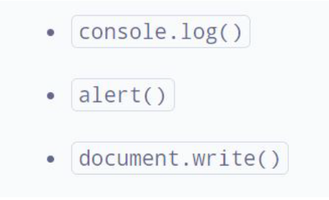

# FrontEnd-Tasks-Repository
Repository for FrontEnd tasks

# Tasks for FrontEnd Development Course
***

## Contents
1. [Task 1]
2. [Task 2]
3. [Task 3]
4. [Task 4]
5. [Task 5]
6. [Task 6]
7. [Task 7]
8. [Task 8]
9. [Task 9]
10. [Task 10]
11. [Task 11]
12. [Task 12]
13. [Task 13]
14. [Task 14]
15. [Task 15]
16. [Task 16]
17. [Task 17]
18. [Task 18]
19. [Task 19]
20. [Task 20]
21. [Task 21]
22. [Task 22]
23. [Task 23]
24. [Task 24]
25. [Task 25]
26. [Task 26]
27. [Task 27]
28. [Task 28]
29. [Task 29]
30. [Task 30]
31. [Task 31]
32. [Task 32]
33. [Task 33]
34. [Task 34]

## Task 1:
1. Download VSCode                      see: https://code.visualstudio.com/Download
2. Download Git                         see: https://git-scm.com/
3. Make an account on GitHub            see: https://github.com/

## Task 2:
1. Clone the existing remote repository https://github.com/ngoncearu/team-repository
2. git fetch the changes from remote repository
3. Create a branch with a name as `name-surname` (ex: natalia-goncearu)
4. Create a new file under app/ namespace
5. Upload this file to github repository

Second part: 
1. Create an own repository called tasks-repository on github
2. Add a file called `firstUploadedFile

## Task 3:
1. Create an html file containing all studied head tags:
* <script>, <base>, <link>, <style>, <meta>, <title>. 
2. Push this file to your private github repository.

## Task 4:
1. Add to the existing html document containing <head></head> tag - the body tag. Insert into body:
- 3 blocks with colors as images - at your discretion. Next to each image put the color name. When I would move the mouse over the picture I wanna see some additional information about the color.
- add all headings ordered from the last important to the most important
one
- the document has to contains 5 comments.
2. To create an .html file containing following tags:

3. Readme.md file with done execises.
  
## Task 5: 
1. Create a document.html file which should contains minimum all this elements:

2. create a file ordered.html. Set the title and a top level heading to Ordered List. Create an ordered list with 7 or more related items of your choosing. Put a second level heading above the list with text describing what types of items the list contains.
3. create a file unordered.html. Set the title and a top level heading to Unordered List. Create an unordered list with five or more related items of your choosing. Put a second level heading above the list with text describing what types of items the list contains.
4. Create a file description.html. Set the title and a top level heading to Description List. Create a descriptions list with descriptions of the following HTML terms:
1) HTML
2) HTML element
3) HTML tag
4) HTML attribute
5) HTML comment

Put a second level heading above the description list with HTML Terms as text.

## Task 6:
1. create a file table.html and set the title and a top level heading to Table I. Use what you've learned in this lesson to produce the following table(**) inside the new document:

2. Create a form with minimum fields those shown in the image.
- 3 fields should be required
- 1 field should be readonly with some default data
- add password field with minimum 8 characters
- all fields should have placeholder
- add reset button
- add file input which will accept only images

                                        
## Task 7: 
1. Create a new html file containing a table (at your discretion). Style the file with internal css style. You should use all type of selectors which you know.
2. Create a new html file containing a nested list. Create a new .css file calles listStyle.css. Add styles to the list and import it as external style css. example of styling: text-size, text-font, background-color, border, text-align, color…

## Task 8:
1. Create an ordered list with icons. In order to do it you should have:
- an ordered list
- with the pseudo elements studied replace `default` bullet with a content you choose (emoji, image, text, etc.)       
  example: https://unicode.org/emoji/charts/full-emoji-list.html

2. Create a form with: name, email, url, password, gender. When the input is active the border color should be red and while entering text should be pink. 

## Task 9:
1. Add a file with a table. The table should contains min 5 colors with 3 possibile shades of them. Style each cell with a shade with different colors unit. The first one - with the color name, second one - hex and third one rgb/rgba.

  
## Task 10:
1. Add a file called boxModel.html. The body should contains a box with:
  ● A 5px, black, dotted border. 
  ● A top margin of 20px. 
  ● A right margin of 1em. 
  ● A bottom margin of 40px. 
  ● A left margin of 2em. 
  ● Padding on all sides of 1em. 
  The body should contains another box styled as you want. Apply the box-sizing properties to both boxes and see the difference on them.

2. Add a new file where you will add at least 3 images. The content should be displayed as you want but you should use the model box components. 
  Add a border and try to use as many properties as you want. Add some background color around images and try to use as many background
  properties as you want.

## Task 11:
1. Add a new file. The file should contains 9 blocks. Each block should contains a quoate. Display in different ways each quote and style it. Examples:

            
## Task 12:
1. 
2. 

## Task 13:
1. Add a sidebar and main content floated next to each other with a cleared footer. Make sure the header contains logo and navigation. Let’s use here floats, display property with list and table options and add some content inside boxes. (a list, a table, etc.)

## Task 14:
1. Let’s create a new responsive layout page with flexbox.

## Task 15:
1. Create 9 different files with grid containers with the following layouts:

## Task 16:
1. Create a simple calculator as on picture with HTML and CSS.
2. Add effects on hover when passing over the numbers.

## Task 17:
Let’s create our first js program. Let’s write ‘Hello, World!’ using:

## Task 18: 
1. Temperature converter:
● Store a celsius temperature into a variable.
● Convert it to fahrenheit and output "nn°C is nn°F".
● Now store a fahrenheit temperature into a variable.
● Convert it to celsius and output "nn°F is nn°C."

2.

1. Declare and assign a variable for each item in the list.
2. For each variable you declared use the typeof operator to print its type to the console, one item per line.
3. We need to determine how many days it will take to reach Mars.
a) Create and assign a miles to Mars variable. You can get the miles to Mars by multiplying the
distance to Mars in kilometers by the miles per kilometer.
b) Next, we need a variable to hold the hours it would take to get to Mars. To get the hours, you
need to divide the miles to Mars by the shuttle's speed.
c) Finally, declare a variable and assign it the value of days to Mars. In order to get the days it will
take to reach Mars, you need to divide the hours it will take to reach Mars by 24.
4. Using variables from above, print to the screen a sentence that says "_____ will take ___ days to reach Mars." Fill in the blanks with the shuttle name and the calculated time.

## Task 19:
1. Give the difference between a given number.
Write a JavaScript program to get the difference between a given number and 13, if the number is greater than 13 return double the absolute difference ((n - 13) *2)
2. Check two given integers, whether one is positive and another one is negative.
Write a JavaScript program to check from two given integers, whether one is positive and another one is negative. (primim 2 parametri și verificam daca cel puțin unul din parametri este negativ).
3. Calculate multiplication and division of two numbers.
Write a JavaScript program to calculate multiplication and division of two numbers (input from user).

  
## Task 20:
1. Write a program to find the types of an angle. Types of angles:
• Acute angle: An angle between 0 and 90 degrees.
• Right angle: An 90 degree angle.
• Obtuse angle: An angle between 90 and 180 degrees.
• Straight angle: A 180 degree angle.

2. Write a JavaScript function which accepts an argument and returns the type.

3. Write a function which takes an argument. The argument should be a country abbreviation. Based on the abbreviation return the phone prefix! Should be minimum 10 countries.
https://www.nationsonline.org/oneworld/country_code_list.htm
  
Task-21_JavaScript_Arrays
## Task 21:
1. Write a simple JavaScript program which will receive as first parameter an array and as second parameter a separator and will return a string.
2. Write a JavaScript function that if will receive a number as argument will return the reverse of it. For example: 345 => 543 and if will receive as argument a string will 
  return this string with letters ordered by alphabetical order. Ex: ‘anb’ => ‘abn’

Task-22_JavaScript_Arrays_Continue
## Task 22:

1. Write a program which will receive as an argument an array of data containing also duplicated values and will return an array of uniques values. As result we should also show the most frequent item from initial array. (ex: [1, 4, 5, 1, 5, 1] => [1, 4, 5] ‘most frequent is 1’)
2. Write a program which will receive as argument an array of numbers and will return the minimum and the maximum numbers from it.
3. Write a program in which user will add value from input and they will create an array with entered values. On display click we should see every element position and value as in the image below: (you can enter any type of data, not just numbers)

## Task 23:
1. Think of a way to introduce some events on your page on your own project.
2. Add a span to an HTML page and style it to appear like a button. Add a listener for click events to the button so that, when the button is clicked, an image of your choosing is displayed below the button. The image may be present in the mark-up before the button is clicked, but should be hidden from view. Add a second event handler to the image. When the image is clicked, hide the image again. Add a second button (also built from a span element) next to the first one. When this button is clicked, the event listener should completely remove the image from the page. Don’t forget to remove the event handler attached to the image.
3. Add an event listener for click events on an element of your choice. The event listener should maintain a count of the number of times the element is clicked. Log the count to the console each time it increments. *Add an event listener for keyboard events to the html element of a web page. When a specific combination of keys are pressed (for example, a, b,
c, d), display a specific message.
4. Create a form with five input fields and a submit button. Without using the required attribute, catch form submissions and reject them if each field has not been completed.

Task-24_JavaScript_Objects
## Task 24:
1. Create a simple "Car" object that has the following properties:
● make (e.g., "Toyota")
● model (e.g., "Camry")
● year (e.g., 2020)
● color (e.g., "red")
And the following methods:
● start: This method should simply console log "The car is starting" when called.
● drive: This method should console log "The car is driving" when called.
● stop: This method should console log "The car is stopped" when called.
● honk: This method should console log "Honk Honk!" when called
You can add more details to the object, like adding fuel consumption and speed or make the car object to be controlled by a driver object. You can also create multiple car object and see the result.

2.  Create an object to hold information on your favorite recipe. It should have properties for title (a string), servings (a number), and ingredients (an array of strings). On separate lines (one statement for each), show the recipe information so it looks like:

3. Create an array of objects, where each object describes a book and has properties for the title (a string), author (a string), and alreadyRead (a boolean indicating if you read it yet). Iterate through the array of books. For each book, log the book title and book author like so: "The Hobbit by J.R.R. Tolkien". Now use an if/else statement to change the output depending on whether you read it yet or not. If you read it, log a string like 'You already read "The Hobbit" by J.R.R. Tolkien', and if not, log a string like 'You still need to read "The Lord of the Rings" by J.R.R. Tolkien.'

Task-25_JavaScript_Objects_Methods
## Task 25:

1. Create a "Book" object that has the following properties:
● title (e.g., "Harry Potter and the Sorcerer's Stone")
● author (e.g., "J.K. Rowling")
● pages (e.g., 300)
● currentPage (e.g., 1)
And the following methods:
● read: This method should take in a number as an argument, and it should increment
the currentPage property by that number. It should also console log the message
"Reading [x] pages" where x is the number of pages read.
● checkPage: This method should console log the current page number
● checkPercentage: This method should console log the percentage of pages read.
● isRead: a method that return true or false if the book is read or not.

2. Create an object called "rectangle" that has the following properties:
● width
● height
And the following getters and setters:
● perimeter: This getter should return the perimeter of the rectangle (width +
height) * 2
● area: This getter should return the area of the rectangle (width * height)
● width: This setter should set the width of the rectangle and should not allow
negative values.
● height: This setter should set the height of the rectangle and should not allow
negative values.

3.

  
  
Task-26_JavaScript_Objects_Methods_Continuation
## Task 26:
1. Write a JavaScript function to get the month name from a particular date.
2. Write a JavaScript function to check whether two dates fall on the same week day (you can check their getFullYear, getMonth and getDate values).
3. Write a JavaScript function to get difference between two dates in days.
4. In your own project integrate an element displaying current date on your web site. This element should be displayed in real time.
5. Write a JavaScript function to get the minimum date from an array of dates.
6. Write a JavaScript program to get the width and height of the window(any time the window is resized).

Task-27_JavaScript_String_JS_Object
## Task 27:
1. Write a JavaScript program to get the width and height of the window (any time the window is resized).
2. Write a function that capitalizes the first letter of each word in a given string.
3. Write a function that sorts an array of objects by a given property.
5. You are given an array of student objects, where each student object contains the following properties:
● name: The name of the student (string)
● scores: An array of scores the student has achieved (array of numbers)
Your task is to perform the following transformations:
● Calculate the average score for each student and add it as a new property called averageScore.
● Filter out students whose average score is less than a given threshold.
● Sort the remaining students by their average score in descending order.

Task-28_JavaScript_Regular_Expressions
## Task 28:
1. Write a function to extract numbers from a string.
2. Write a function findCapitalizedWords(str) that returns an array of words that start with a capital letter.
3. Write a function to validate date format according to some special format as for example: ‘YYYY-MM-DD’
4. Write a function findDuplicateWords(str) that returns an array of duplicate words in the string.
5. Write a function to extract the domain from an email.
6. Write validation for an user form data. The output should take into consideration following validation. Add css classes (red,
green) to show errors validation.

Optional:
1.Write a JavaScript form validation script to check whether the required field(s) in the HTML form contains only letters.
2. Write a JavaScript program to set validation for a birth date field. The date should be maximum yesterday date. You can’t select a date starting from today date to the future. 
